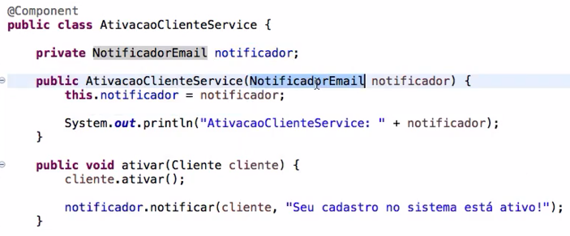
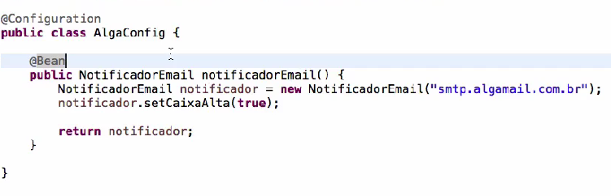

# Delivery API

## Spring boot

### Jakarta EE

É uma especificação/padronização que possui várias outras especificações
Por exemplo o JPA é uma especificação do Hibernate e o próprio Hibernate passou a ser a implementação da especificação JPA.
Porém existem várias outras implementações do JPA fora o Hibernate.

### Starters

São dependências que agrupam outras dependências, isso facilita e diminuiu a quantidade de dependências dentro do pom.xml

### Beans

@Component sinaliza para o spring que aquela classe será um bean instanciado e configurado por ele, possibilitando que seja injetado em outros beans

## Injeção de Dependências

Possui a função de desacoplar o código.
A técnica consiste em passar a dependência (o serviço) para o dependente (o cliente). Isso é a chamada injeção. O importante é entender que injetamos o serviço no cliente, ao invés de o próprio cliente procurar e construir o serviço que irá utilizar.

Na pratica seria:
Criar uma interface que será implementada pelos serviços.
Passar a interface como argumento/dependência da classe/cliente que usará o serviço.
É necessário criar um construtor na classe recebendo a interface como parâmetro.
Dessa maneira, na classe será possível utilizar qualquer serviço que tenha a interface implementada.
O serviço que implementa a interface virou uma dependência da classe.
Ao instanciar a classe será necessário passar um serviço com a interface implementada como argumento.
Ou seja, nos estamos injetando um serviço (dependência) na classe.
Então ao instanciar a classe será possível passar qualquer serviço como argumento desde que o serviço implemente a interface.

## Como fazer injeção de dependência com beans

### @Component

Uma das maneiras é criar um construtor dentro da classe e esse construtor receberá como argumento um serviço/classe gerenciado pelo spring (anotado com @Component).

   

Nesse caso NotificadorEmail é uma classe anotada com @Component.

Para diminuir o acoplamento seria possível substituir a classe NotificadorEmail por uma interface(Notificador, por exemplo) e fazer a classe NotificadorEmail extender essa interface. Dessa maneira qualquer classe anotada com @Component e que extender a interface Notificador poderá ser injetada.

### @Configuration e @Bean

Existirá momentos que além de instanciar o Bean nos iremos querer que o Spring configure algo dentro desse bean/classe, para isso podemos utilizar a anotação @Configuration.

  

Nesse caso estamos anotando a classe com @Configuration, isso mostrará para o spring que essa é uma classe de configuração.
Dentro dessa classe criamos o método notificadorEmail, que será responsável por fazer as configurações do classe NotificadorEmail. Nesse caso estaremos passando um valor no construtor e setando um valor para o atributo.
A anotação @Bean sinaliza que o método instancia, configura e inicializa um novo componente/objeto que será gerenciado pelo container Spring.

### @Autowired

A anotação @Autowired indica onde será o ponto de injeção da classe.
